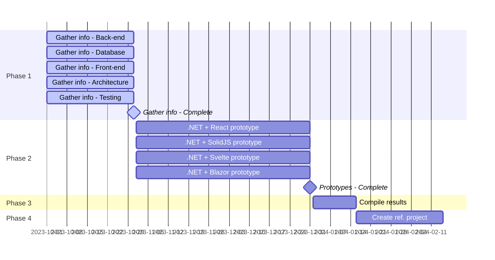

# Ideas about .NET reference architecture
A collection of my ideas, examples, and resources regarding architecture and tech choices for a full-stack enterprise-level .NET Web Application.

## Roadmap 🛣

---

# Back-end
.NET Core C# (.NET 6/7/8)

## Templates
- [jasontaylordev/CleanArchitecture](https://github.com/jasontaylordev/CleanArchitecture)
- [ardalis/CleanArchitecture](https://github.com/ardalis/CleanArchitecture/tree/v8)

## Why C#?
- Popular (Top 7 on GitHub repositories if you discount non-programming languages like Dockerfiles and Makefiles)

https://innovationgraph.github.com/global-metrics/programming-languages

- Open-source
- Cross-platform
- Strongly typed
- Compiled
- Actively developed
- Performant (ASP.NET Core composite score is #7 / 141 frameworks tested on [TechEmpower.com](https://www.techempower.com/benchmarks/#section=data-r21&hw=ph&test=composite))

## Coding-style
- [Coding-style guidelines from the .NET runtime repository](https://github.com/dotnet/runtime/blob/main/docs/coding-guidelines/coding-style.md)
- [Common C# code conventions](https://learn.microsoft.com/en-us/dotnet/csharp/fundamentals/coding-style/coding-conventions)
- [Automatically apply format rules w/ `dotnet format`](https://learn.microsoft.com/en-us/dotnet/core/tools/dotnet-format)

## Logging, tracing, monitoring
- [Logging, tracing and metrics: instrumentation in .NET and Azure - Alex Thissen - NDC London 2023](https://www.youtube.com/watch?v=CdcApjTBLEM)

## Caching
- Redis?
## Logging
## Authentication & Authorization
- [ASP.NET Core SPA Authentication Tutorial (.NET 7 Minimal Apis C#)](https://www.youtube.com/watch?v=DpLtCbW_x2I)
- [Token Authentication In ASP.NET Core 7 With JWT | Clean Architecture](https://www.youtube.com/watch?v=4cFhYUK8wnc)
## Database
- [SQLite vs MySQL vs PostgreSQL](https://www.digitalocean.com/community/tutorials/sqlite-vs-mysql-vs-postgresql-a-comparison-of-relational-database-management-systems)
### MySQL
- [Most popular open-source DBMS](https://db-engines.com/en/)

  

## ORM
### EF Core
### Dapper
## Useful libraries
### MediatR

## API
### Validation
- FluentValidation? https://docs.fluentvalidation.net/en/latest/

### Minimal APIs in C#
- [Minimal APIs documentation (Microsoft Learn)](https://learn.microsoft.com/en-us/aspnet/core/fundamentals/minimal-apis/overview?view=aspnetcore-7.0)
- [Why Minimal APIs (JetBrains)](https://blog.jetbrains.com/dotnet/2023/04/25/introduction-to-asp-net-core-minimal-apis/#why-asp.net-core-minimal-api?)
- [Example repo from Nick Chapsas](https://github.com/Elfocrash/clean-minimal-api)
- [FastEndpoints library](https://fast-endpoints.com/)
- [Goodbye controllers, hello Minimal APIs - Nick Chapsas - NDC London 2022](https://www.youtube.com/watch?v=hPpvlKLeYYA)
  - [2:02](https://youtu.be/hPpvlKLeYYA?t=122): History of Minimal APIs
  - [5:21](https://youtu.be/hPpvlKLeYYA?t=322): How does it work in C#?
  - [9:31](https://youtu.be/hPpvlKLeYYA?t=571): Live demo #1
  - [20:20](https://youtu.be/hPpvlKLeYYA?t=1220): Unsupported features (as of .NET6)
  - [22:20](https://youtu.be/hPpvlKLeYYA?t=1340): "Program.cs hell"
  - [22:15](https://youtu.be/hPpvlKLeYYA?t=1575): "Controllers for APIs are wierd"
  - [37:40](https://youtu.be/hPpvlKLeYYA?t=2260): What are Minimal APIs?
  - [38:05](https://youtu.be/hPpvlKLeYYA?t=2285): Live demo #2
  - [43:26](https://youtu.be/hPpvlKLeYYA?t=2606): Viability of using Minimal APIs depending on project
- [Talk about APIs using MVC, redundancy etc.](https://www.youtube.com/watch?v=d9Bjg31VuHw&t=2625s)

# Front-end
- Protyping tool for colors and fonts: [Realtime Colors](https://www.realtimecolors.com/?colors=000000-ffffff-8fb3ff-ebf1ff-d41d6d)
## Server-Side Rendering (SSR) vs. Client-Side Rendering (CSR)
- [Do you REALLY need SSR?](https://www.youtube.com/watch?v=kUs-fH1k-aM)
### Server-Side Rendering
#### ASP.NET MVC
- [Which C# Web Application Type Should I use? MVC? Blazor? Razor Pages?](https://www.youtube.com/watch?v=YhojOiGjGvQ)
### Client-Side Rendering
#### How to handle Authentication & Authorization?
#### Frameworks
##### Blazor
- [What is the Future of Blazor? Should I Learn Blazor?](https://www.youtube.com/watch?v=OUUlO8fQOfE)
- [Running Blazor in production, lessons learned - Jimmy Engström - NDC London 2023](https://www.youtube.com/watch?v=bZdYpYQb958)
## SPA vs. MPA
### Razor views vs. Razor pages

## JavaScript
### JavaScript vs. TypeScript
- TypeScript resource: [Matt Pocock](https://www.youtube.com/@mattpocockuk/videos)
- [The TSConfig Cheat Sheet](https://www.youtube.com/watch?v=eJXVEju3XLM)

### Tooling
#### Vite
- https://vitejs.dev/
- https://vitejs.dev/guide/#getting-started

### Frontend Frameworks
#### Svelte
- [Understanding Svelte (vs React)](https://www.youtube.com/watch?v=lYYGhm7p74Q)
- [Svelte Actions Make Svelte The Best JavaScript Framework](https://www.youtube.com/watch?v=LGOqg0Y7sAc)
#### React
- [React+TypeScript Cheatsheets](https://github.com/typescript-cheatsheets/react)
#### SolidJS
- [What is SolidJS (vs React and Svelte)?](https://www.youtube.com/watch?v=A_dUsSzxwkI)
#### Meta-framework?
### Component library?

# Deployment
## Azure

# Architecture
## CQRS
- [CQRS and MediatR in ASP.NET Core](https://code-maze.com/cqrs-mediatr-in-aspnet-core/)
- [CQRS - Martin Fowler](https://martinfowler.com/bliki/CQRS.html)
- [CommandQuerySeparation - Martin Fowler](https://martinfowler.com/bliki/CommandQuerySeparation.html)
- [Microsoft Learn](https://learn.microsoft.com/en-us/azure/architecture/patterns/cqrs)
- [TechTarget](https://www.techtarget.com/searchapparchitecture/definition/CQRS-command-query-responsibility-segregation)
- [CQRS Doesn't Have To Be Complicated | Clean Architecture, .NET 6](https://www.youtube.com/watch?v=vdi-p9StmG0)
  
## Talks & Presentations
- [Modular Monoliths • Simon Brown • GOTO 2018](https://www.youtube.com/watch?v=5OjqD-ow8GE)
  - [17:45](https://youtu.be/5OjqD-ow8GE?t=1065): Example of adding a feature in a system without clear encapsulation/structure, controllers calling repositories, etc...
  - [18:50](https://youtu.be/5OjqD-ow8GE?t=1130): If previous example is left unchecked, what happens? References between everything...
  - [19:31](https://youtu.be/5OjqD-ow8GE?t=1171): "Big Ball of Mud", "Its organization [...] is dictated more by expediency than design"
  - [29:24](https://youtu.be/5OjqD-ow8GE?t=1764): The effects of an overuse of the "public" keyword
  - [34:47](https://youtu.be/5OjqD-ow8GE?t=2087): Using encapsulation to minimize dependencies
  - [39:52](https://youtu.be/5OjqD-ow8GE?t=2392): "When you change something here, a whole bunch of stuff here breaks and you don't know why [...]"
  - [40:03](https://youtu.be/5OjqD-ow8GE?t=2403): Good architecture/good structure/high modularity enables fast development
  - [42:14](https://youtu.be/5OjqD-ow8GE?t=2534) / [44:47](https://youtu.be/5OjqD-ow8GE?t=2687): Start with a Modular Monolith THEN (maybe) move into Microservices
## Articles
## Books

# Testing
## End-to-end/Functional testing
- [Playwright](https://playwright.dev/)
  - [Playwright testing in Azure](https://azure.microsoft.com/en-us/products/playwright-testing/) 
## Useful libraries
## Strategy

# Version-control (git)
## Branching strategy
## Merge strategy
## Thoughts about commit messages

# General tools etc.
## Rest Client for VS Code
Would be nice to have a "samples" folder in the project with pre-baked HTTP requests for different things in the system

- https://marketplace.visualstudio.com/items?itemName=humao.rest-client

## Mindmaps
- [Mindmeister](https://www.mindmeister.com/)
